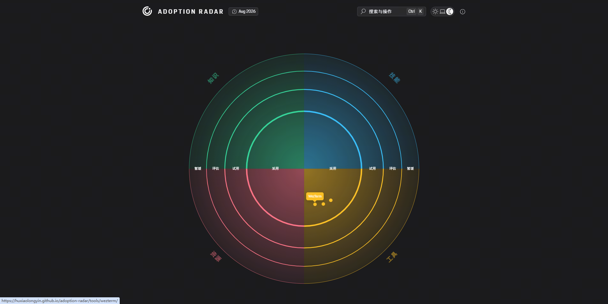

# Adoption Radar

Adoption Radar 是一张持续更新的个人采纳雷达，用来表达当前对知识、技能、工具与资源的判断：哪些已经采用，哪些正在试用，哪些值得评估，以及哪些暂时不再推荐。

[在线访问 Adoption Radar](https://huxiaolongyin.github.io/adoption-radar/)

[](https://huxiaolongyin.github.io/adoption-radar/)

## 如何阅读

每个雷达条目由两个位置共同表达：

- **分区**说明条目属于知识、技能、工具还是资源。
- **采纳环**说明当前判断是采用、试用、评估还是暂缓。

这些判断不是永久评级。随着实际需求和使用经验变化，条目可以在后续发布版本中调整位置或补充说明。

## 项目实现

站点以 Markdown 维护雷达条目，使用 [Porsche Digital Technology Radar Generator](https://github.com/porscheofficial/porschedigital-technology-radar) 生成静态页面，并由 GitHub Actions 发布到 GitHub Pages。

## 本地开始

项目需要 Node.js 22 或更高版本：

```powershell
npm ci
npm run validate
```

本地开发、内容维护、品牌资产和发布流程见 [DEVELOPMENT.md](DEVELOPMENT.md)。

## 项目文档

- [领域语言](CONTEXT.md)：项目使用的核心术语及边界。
- [系统架构](ARCHITECTURE.md)：内容输入、生成流程与发布拓扑。
- [开发与维护](DEVELOPMENT.md)：本地命令、条目维护和验证流程。
- [品牌规范](docs/brand/README.md)：Logo、颜色、资产与使用规则。
- [Agent 协作约定](AGENTS.md)：文档路由、修改边界与验证要求。

## 许可

本仓库使用 [MIT License](LICENSE)。Porsche Digital Technology Radar Generator 作为依赖使用，并遵循其自身许可证。
